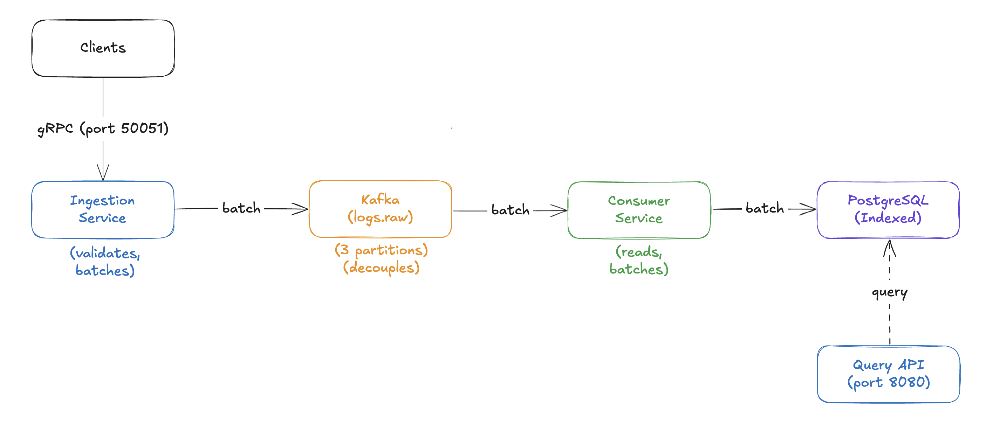

# LogStream - Distributed Log Ingestion System

A horizontally scalable log ingestion pipeline inspired by Datadog's intake system. While I don't have enough AWS credits to actually deploy this to EKS, I use distributed systems concepts with Go, gRPC, Kafka, and PostgreSQL.

The demo is deployed to EC2, but this could easily be modified and deployed to EKS.

## Project Summary

LogStream is a production-ready log ingestion system that accepts logs via gRPC, processes them through Kafka for reliability and decoupling, and stores them in PostgreSQL for querying. The system includes patterns including batching, backpressure handling, and stateless service design.

**Tech Stack:**
- **Go** - High-performance backend services
- **gRPC** - Protocol for log ingestion
- **Kafka** - Message queue for decoupling and reliability
- **PostgreSQL** - Queryable log storage with JSONB support
- **Docker Compose** - Local development and single-node deployment
- **Terraform** - Infrastructure as Code for AWS deployment
- **AWS EC2** - Cloud hosting (t3.small, ~$15/month)

**Key Features:**
- Time and size-based batching for throughput optimization
- Graceful shutdown with proper resource cleanup
- Input validation and error handling
- Horizontal scalability through Kafka partitioning
- Pagination and filtering for query API

## Architecture Design



### Component Details

**Ingestion Service**
- Accepts `IngestRequest` via gRPC with batches of log entries
- Validates required fields (service, level, message)
- Batches logs (100 entries or 5 seconds, whichever comes first)
- Produces to Kafka topic `logs.raw` with service name as partition key
- Uses protobuf binary encoding for efficiency

**Kafka**
- 3 partitions for horizontal scaling demonstration
- 24-hour retention policy
- Allows multiple consumers to read independently
- Enables replay and operational recovery

**Consumer Service**
- Consumer group for horizontal scaling capability
- Reads from Kafka, deserializes protobuf messages
- Batches inserts to PostgreSQL for performance
- Connection pooling (25 max connections)
- Handles nullable fields (trace_id, metadata, tags)

**PostgreSQL**
- Indexed on timestamp, service, level, trace_id
- JSONB metadata for structured query support
- TEXT[] for tags with GIN indexing
- Sample data included for testing

**Query API**
- `GET /health` - Health check endpoint
- `GET /query?service=X&level=Y&from=Z&to=W&limit=N&page=P` - Filter and paginate logs
- `GET /query/{trace_id}` - Find all logs for a distributed trace
- Returns JSON with metadata

## Demo

[](https://youtu.be/6lHBzjJTlIE)

(2 minute demo)

## Getting Started

### Prerequisites

- **Docker & Docker Compose** - For local development
- **Go 1.24+** - For building services
- **protoc** - Protocol buffer compiler
- **grpcurl** - For testing gRPC endpoints
- **AWS Account** - For cloud deployment (optional)
- **Terraform** - For infrastructure provisioning (optional)

### Local Development

1. **Clone the repository:**
   ```bash
   git clone https://github.com/nhulston/logstream.git
   cd logstream
   ```

2. **Start all services:**
   ```bash
   docker-compose up -d
   ```

3. **Verify services are running:**
   ```bash
   docker-compose ps
   ```

4. **Send test logs:**
   ```bash
   ./scripts/test-ingest.sh
   ```

5. **Query logs via API:**
   ```bash
   # Get all logs
   curl "http://localhost:8080/query?limit=10" | jq .

   # Filter by service
   curl "http://localhost:8080/query?service=web-api" | jq .

   # Filter by level
   curl "http://localhost:8080/query?level=ERROR" | jq .

   # Health check
   curl "http://localhost:8080/health"
   ```

6. **Query Postgres directly:**
   ```bash
   docker exec -it logstream-postgres psql -U logstream -d logstream
   SELECT service, level, message FROM logs ORDER BY ingested_at DESC LIMIT 10;
   \q
   ```

7. **View logs:**
   ```bash
   docker-compose logs -f ingestion
   docker-compose logs -f consumer
   docker-compose logs -f query
   ```

8. **Stop services:**
   ```bash
   docker-compose down
   ```

### AWS Deployment

1. **Configure AWS credentials:**
   ```bash
   aws configure --profile personal
   # Or use aws-vault: aws-vault add personal
   ```

2. **Create SSH key pair:**
   ```bash
   aws ec2 create-key-pair --key-name logstream-key --query 'KeyMaterial' --output text > ~/.ssh/logstream-key.pem
   chmod 400 ~/.ssh/logstream-key.pem
   ```

3. **Deploy infrastructure:**
   ```bash
   cd terraform
   terraform init
   terraform apply
   ```

4. **Get connection details:**
   ```bash
   terraform output
   ```

5. **Test deployed services:**
   ```bash
   # Get IP from terraform output
   export EC2_IP=$(terraform output -raw instance_public_ip)

   # Send logs
   ./scripts/test-ingest.sh $EC2_IP:50051

   # Query logs
   curl "http://$EC2_IP:8080/query?limit=5" | jq .
   ```

6. **SSH into instance:**
   ```bash
   ssh -i ~/.ssh/logstream-key.pem ec2-user@$EC2_IP
   cd ~/logstream
   docker-compose ps
   ```

7. **Cleanup (to avoid charges):**
   ```bash
   terraform destroy
   ```

### Development

**Regenerate protobuf:**
```bash
protoc --go_out=proto/gen --go_opt=paths=source_relative \
       --go-grpc_out=proto/gen --go-grpc_opt=paths=source_relative \
       proto/logs.proto
```

**Run individual service:**
```bash
cd services/ingestion
export GRPC_PORT=50051
export KAFKA_BROKERS=localhost:9092
go run cmd/main.go
```

**Build Docker image:**
```bash
docker-compose build ingestion
```

## API Examples

### Ingest Logs (gRPC)

```bash
grpcurl -plaintext -import-path proto -proto logs.proto -d '{
  "logs": [
    {
      "timestamp": "2024-11-06T12:00:00Z",
      "service": "api-gateway",
      "level": "INFO",
      "message": "Request processed successfully",
      "host": "api-01",
      "tags": ["http", "success"]
    }
  ]
}' localhost:50051 logstream.LogIngestion/Ingest
```

### Query Logs (HTTP)

```bash
# Get recent errors
curl "http://localhost:8080/query?level=ERROR&limit=10"

# Search specific service
curl "http://localhost:8080/query?service=web-api&limit=20"

# Pagination
curl "http://localhost:8080/query?page=2&limit=50"
```
